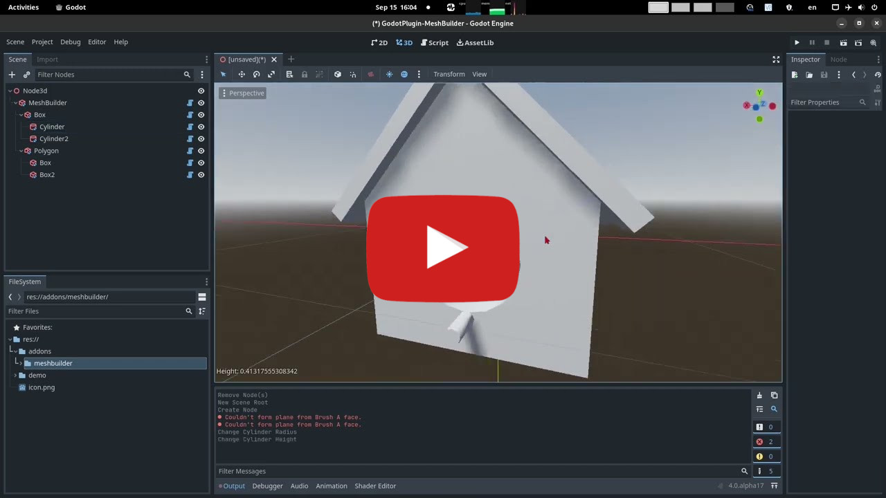

# MeshBuilder (Godot Plugin)

This is a Godot 4 plugin to quickly build 3D meshes via basic CSG shapes and community-created CSG shapes

# How to use
- Use Godot 4
- Add the `meshbuilder` folder into your Godot addons folder (`res://addons/meshbuilder`)
- Enable the addon in `Project/Project Settings/Plugins`
- Add a `MeshBuilder` node to your scene
- Select the `MeshBuilder` node to start building
- Once your done, you can `Finalize` your work to convert it to a `MeshInstance3D`

# Basic Tab
- Add basic shapes (Polygon, Cone, Cube, Cylinder, Sphere, Half-Sphere, Torus, Ring)
- Click `Finalize` button to convert your mesh once you're done

# Community Tab
- Add complex shapes created by the community (Chair, Table, Bird House, Bucket...)
- Use the `Search` field to search through the list of existing shapes
- Click `Publish` button to publish your mesh and make it available to the rest of the community
- Click `Finalize` button to convert your mesh once you're done

# Publishing
- In `Community` tab, by clicking `Publish` button you are asked to confirm that you are OK with making that shape available to the public
- Once you do, I (Edouard) will verify the shape you published and add it to the database of community shapes
- When I am done, everyone will be able to see your new shape in the `Community` tab !
